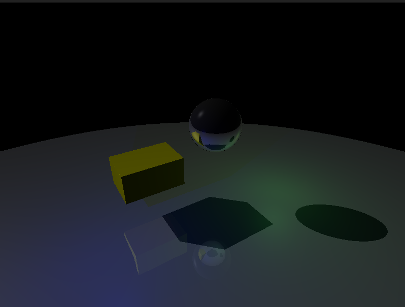

# Real-Time Ray Tracing Engine

Um motor de ray tracing em tempo real implementado em C com OpenGL, apresentando reflexões, sistema de iluminação avançado e animação baseada em curvas de Bézier.



## 🚀 O que o código faz

Este projeto implementa um **motor de ray tracing em tempo real** com as seguintes funcionalidades:

### Funcionalidades Principais
- **Ray Tracing Recursivo**: Reflexões realistas com profundidade configurável (até 3 níveis)
- **Sistema de Iluminação Avançado**: 10 luzes controláveis individualmente (ambiente, direcional e pontual)
- **Animação Física**: Bola quicando com física realista usando curvas de Bézier
- **Controles Interativos**: Câmera 6DOF, controle de luzes e animações
- **Ray Marching SDF**: Rendering eficiente usando Signed Distance Fields
- **Multi-threading**: Paralelização com OpenMP para melhor performance

### Objetos da Cena
- **Esfera Reflexiva**: Esfera cromada com alta reflectividade
- **Cubo Amarelo**: Objeto difuso para demonstrar iluminação
- **Plano Reflexivo**: Chão espelhado que reflete toda a cena

### Sistema de Luzes
- **Luz 0**: Ambiente geral (branca)
- **Luz 1**: Direcional principal (branca)
- **Luz 2**: Pontual azul
- **Luz 3**: Pontual vermelha
- **Luz 4**: Pontual verde
- **Luz 5**: Direcional roxa
- **Luz 6**: Pontual laranja
- **Luz 7**: Direcional ciano
- **Luz 8**: Pontual amarela
- **Luz 9**: Ambiente quente

## 🎮 Controles

| Tecla | Função |
|-------|--------|
| `W/S` | Mover câmera frente/trás |
| `A/D` | Mover câmera esquerda/direita |
| `Q/E` | Mover câmera cima/baixo |
| `↑/↓/←/→` | Rotacionar câmera |
| `R` | Ligar/desligar reflexões |
| `P` | Pausar/continuar animação |
| `0-9` | Ligar/desligar luzes individuais |
| `ESC` | Sair |

## 🛠️ Como Compilar e Executar

### Dependências

#### Ubuntu/Debian:
```bash
sudo apt-get update
sudo apt-get install build-essential
sudo apt-get install freeglut3-dev
sudo apt-get install libgl1-mesa-dev
sudo apt-get install libglu1-mesa-dev
sudo apt-get install libomp-dev
```

### Compilação

```bash
# Clone o repositório
git clone https://github.com/tahaluh/raycasting-cg.git
cd raytracing-gravity

# Compile o projeto
make clean && make

# Execute
make run
```

### Makefile Targets

```bash
make            # Compila o projeto
make clean      # Limpa arquivos objeto
make run        # Compila e executa
make debug      # Compila com símbolos de debug
```

## 🏗️ Arquitetura do Projeto

```
src/
├── main.c              # Loop principal e inicialização
├── core/
│   ├── utils.h         # Utilitários matemáticos
│   └── vec3.h          # Operações com vetores 3D
├── body/
│   ├── body.c          # Geometrias (esfera, cubo, plano)
│   └── body.h
├── lighting/
│   ├── lighting.c      # Sistema de iluminação e reflexões
│   └── lighting.h
├── ray/
│   ├── ray.c           # Ray marching e SDF
│   └── ray.h
├── render/
│   ├── render.c        # Pipeline de renderização
│   └── render.h
└── scene/
    ├── scene.c         # Gerenciamento da cena e animações
    └── scene.h
```

## 🔧 Principais Problemas Encontrados

### 1. **Performance com Múltiplas Luzes**
- **Problema**: Adicionar luzes extras (3-10) causou queda significativa de performance
- **Causa**: Sistema calculava iluminação para todas as luzes, mesmo desabilitadas
- **Solução**: Otimização do `scene_get_lights()` para retornar apenas luzes ativas

### 2. **Thread Safety em Multi-threading**
- **Problema**: Race conditions com arrays estáticos compartilhados
- **Causa**: OpenMP threads acessando mesma memória simultaneamente
- **Solução**: Implementação de `__thread` storage para arrays thread-local

### 3. **Precisão de Ray Marching**
- **Problema**: Artefatos visuais e "ray leaking" em intersecções
- **Causa**: Epsilon inadequado e limites de passos insuficientes
- **Solução**: Ajuste fino de constantes (epsilon=0.001f, max_steps=128)

### 4. **Complexidade de Reflexões**
- **Problema**: Reflexões recursivas causavam stack overflow
- **Causa**: Profundidade infinita em superfícies paralelas
- **Solução**: Limite de profundidade (depth=3) e offset de origem

## 🚀 Melhorias Possíveis

1. **Aceleração via GPU**: 
   - Implementar o algoritmo em código que rode diretamente na GPU
   - Usar execução paralela massiva para processar muitos raios simultaneamente
   
2. **Otimizações de Ray Marching**:
   - Implementar sphere tracing adaptativo
   - Usar acceleration structures (BVH, octrees)

3. **Anti-aliasing**:
   - Implementar MSAA ou supersampling
   - Adicionar temporal anti-aliasing

4. **Materiais Avançados**:
   - PBR (Physically Based Rendering)
   - Texturas e normal mapping
   - Transparência e refração

5. **Sistema de Sombras**:
   - Soft shadows com area lights
   - Shadow mapping para performance

## 📊 Especificações Técnicas

- **Linguagem**: C99
- **Graphics API**: OpenGL 2.1 + GLUT
- **Paralelização**: OpenMP
- **Arquitetura**: Ray marching com SDF
- **Profundidade de Reflexão**: 3 níveis
- **Resolução Padrão**: 800x600
- **Multi-threading**: Sim 
- 
---

**Desenvolvido por**: [Thauã Magalhães](https://github.com/tahaluh)  
**Curso**: INTRODUÇÃO À COMPUTAÇÃO GRÁFICA
**Instituição**: Universidade Federal da Paraíba
